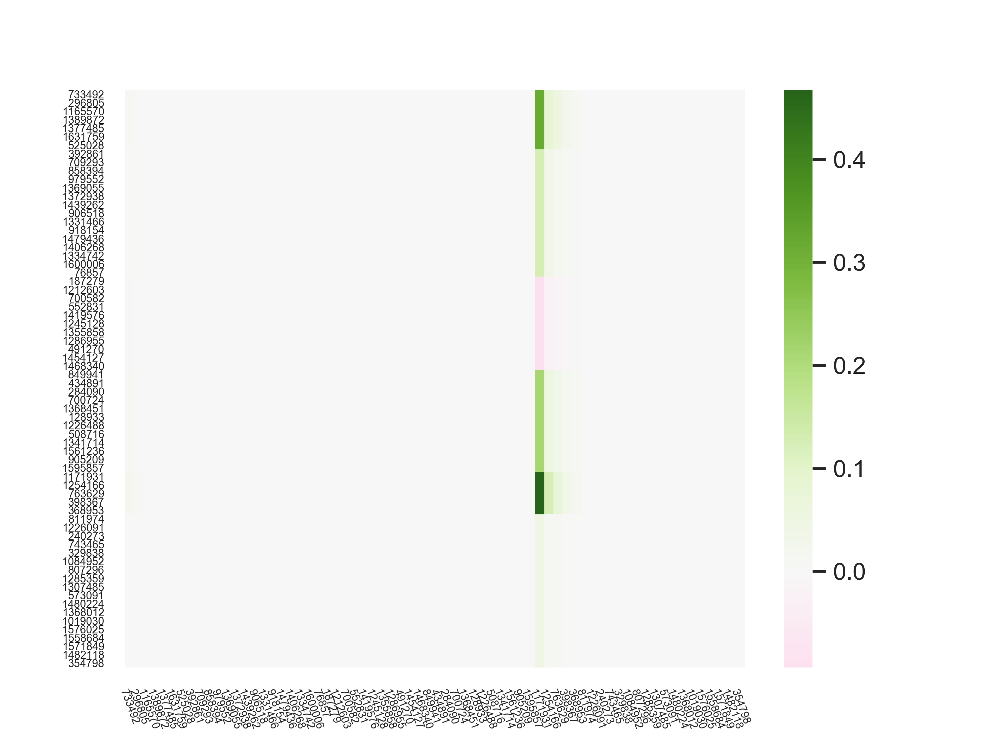

[](http://quantlet.de/)

## [](http://quantlet.de/) **ONSM** [](http://quantlet.de/)

```yaml

Name of QuantLet : ONSM

Published in : ''

Description : 'An integration of social media characteristics into an econometric framework requires modeling a high dimensional dynamic network with dimensions of parameter $\Theta$ typically much larger than the number of observations. To cope with this problem we impose two structural assumptions onto the singular value decomposition of $\Theta = U D V^{\top}$. Firstly, the matrix with probabilities of connections between the nodes of a network has a rank much lower than the number of nodes. Therefore, there is limited amount of non-zero elements on the diagonal of $D$ and the whole operator admits a lower dimensional factorisation. Secondly, in observed social networks only a small portion of users are highly-affecting, leading to a sparsity regularization imposed on singular vectors $V.$

Using a novel dataset of 1069K messages from 30K users posted on the microblogging platform StockTwits during a 4-year period (01.2014-12.2018) and quantifying their opinions via natural language processing, we model their dynamic opinions network and further separate the network into communities. With a sparsity regularization, we are able to identify important nodes in the network.'

Keywords : 'network, autoregression, high-dimensional inference, sentiment weight, stocktwits'

Author : 'Yegor Klochkov'

Submitted : 'April 14 2019 by Yegor Klochkov'

Datafile :
- data/users_daily_timeseries_AAPL.csv
- data/users_BTC_timeseries_Daily.csv

Example :
- theta_daily_AAPL.png
- theta_daily_BTC.png

```




### PYTHON Code
```python

import read_data
import missing
import numpy as np
import matplotlib.pyplot as plt
import seaborn as sns

from alternating import matrix_competition

if __name__ == '__main__':
    tasks = [
        ('data/users_daily_timeseries_AAPL.csv', "theta_daily_AAPL.png")
        , ('data/users_BTC_timeseries_Daily.csv', "theta_daily_BTC.png")
    ]

    for task in tasks:
        data_path, save_path = task

        Y, deltas, names = read_data.read_stock_twits_user_sentiment(data_path, min_days=50, min_delta=0.5)
        N, tmax = np.shape(Y)
        print(N, tmax)

        D0 = missing.missing_var(Y[:, :-1], deltas)
        D1 = missing.missing_covar(Y[:, 1:], Y[:, :-1], deltas, deltas)

        # SET NUMBER OF CLUSTERS
        num_clusters = 10

        res = matrix_competition(50, num_clusters, num_clusters, D0, D1, 0.05, epochs=10)
        theta_est, v_est, u_est, ind_est, loss = res.theta, res.v, res.u, res.index, res.loss

        lists = [[] for i in range(num_clusters)]
        for i in range(N):
            lists[res.index[i]].append(i)

        rearrange = []
        for j in range(num_clusters):
            rearrange += lists[j]
        theta_sort = theta_est[rearrange].T
        theta_sort = theta_sort[rearrange].T

        plt.figure()
        sns.set()
        ax = sns.heatmap(theta_sort, center=0, xticklabels=names[rearrange], yticklabels=names[rearrange], cmap="PiYG")
        ax.set_xticklabels(ax.get_xticklabels(), rotation=-70, fontsize=5)
        ax.set_yticklabels(ax.get_yticklabels(), rotation=0, fontsize=5)
        #plt.show()
        plt.savefig(save_path, dpi=500)


```

automatically created on 2019-04-15